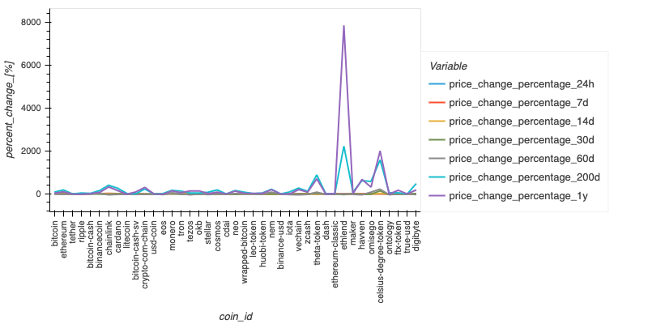
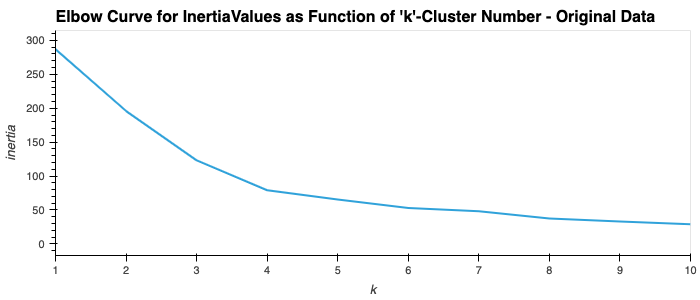
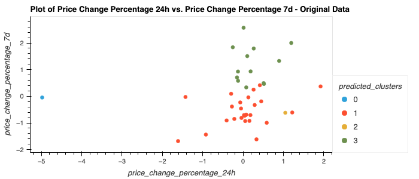
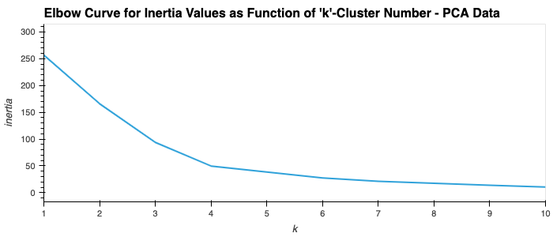
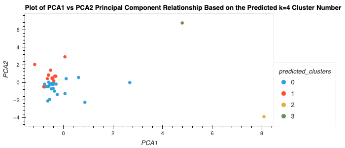

# <b> Module-10-Challenge </b>

## <b> Crypto Clustering </b>

## --------

## Overview

The purpose of this assignment is to utilize traditional & unsupervised clustering techniques to find correlation patterns within a basket of cryptocurrencies across different
time period intervals.

## Features

The main tasks outlined in this project will include:

1.) Importing the required libraries and dependencies including scikit library & its required modules including KMeans, PCA & StandardScaler.  
 
2.) Importing the raw cryptocurrency price change data via the .csv files and convert into the appropriate dataframe and plotted to display the entire series of individual cryptocurrencies by type vs percent change. These individual cryptocurrencies are finally grouped and displayed by 'groupby' across expanding time intervals (i.e. 24h, 7d, 14d, etc.). (See Figure 1)
 
 
3.) Next, utilizing scikit-learn StandardScaler & fit_transform module, the original crypto dataframe is normalized in order to change the scale of the data (to enable easier normal distribution relationship presentation & linear relationship analysis) and the index is set by crypto coin id type.
 
 
4.) Furthermore, utilizing the scaled crypto dataframe created above, the data is next run through a KMeans algorithm model to determine an optimized value of k. This is done by plotting the inertia product (as a function of k-values from 1-10 based on the original dataframe percent change values). The optimal value is determined somewhat subjectively as the inertia product values are plotted as an 'elbow-curve' using hvplot as a function of each individual k-means value. (See Figure 2).
 
 
5.) The original scaled cryptocurrency dataframe data is then cluster according to the previously optimized k-means value. The 'predict' function of the KMeans module is used to predict the clusters of cryptocurrency and produce an array of predicted k-clusters. These are then plotted with x="price_change_percentage_24h" and y="price_change_percentage_7d" on an hvplot and each cluster color coded according to its cluster number. (See Figure 3).
 
 
6.) In the next section of the program, the scaled crypto dataframe undergoes a PCA (principal component analysis) basis of transformation to specifically reduce the number of features to n_components=3. Additionally, using the scikit-learn decomposition/pca module, the hierarchal explained variance ratio is calculated to determine that the first 3 pca components can account for 89.5% of the observed variance, and hence, be a sufficiently accurate representation of the objective data correlation fidelity. A new dataframe is also produced with the 3 pca dataset components representing every indexed row (coin id representation) in the original dataframe.
 
 
7.) Again, the elbow-curve derivation is used to determine the best value of k-means for the 3-component pca dataframe created above. Again, the relationship to the inertia values of the pca dataframe (as a function of each k-means value) are plotted for visual analysis. (See Figure 4).
 
 
8.) Finally, similarly as before, the original cryptocurrencies (using pca data reduction, this time) are scatter plotted using hvplot and clustered in groups according to the optimal k-means determined value using pca components. (See Figure 5).

## Data Analysis Results and Observations

### <u>Percent Change as a Function of Coin ID Grouped by Variable Time Interval</u>

 

    

<i>Figure 1. Original dataframe imported from .csv file with percent change as a function of each individual cryptocurrency. Each is color coded grouped by its specific analyzed time interval.</i>

 

### <u>Elbow Curve for Inertia Values as Function of 'k'-Cluster Number - Original Data</u>

 

    

<i>Figure 2. THe elbow curve is generated using original crypto dataframe values as inertia is a function of k-means. The largest rate of slope change is observed at the graph
vertex whereby k-mean=4.</i>

 

### <u>Plot of Price Change Percentage 24h vs. Price Change Percentage 7d - Original Data</u>

 

    

<i>Figure 3. Plot of Price Change Percentage 24h vs. Price Change Percentage 7d - Original Data.</i>

 

### <u>Elbow Curve for Inertia Values as Function of 'k'-Cluster Number - PCA Component Data</u>

 

    

<i>Figure 4. Elbow Curve for Inertia Values as Function of 'k'-Cluster Number - PCA Component Data .</i>

 

### <u>Plot of PCA1 vs PCA2 Principal Component Relationship Based on the Predicted k=4 Cluster Number</u>

 

    

<i>Figure 5. Plot of PCA1 vs PCA2 Principal Component Relationship Based on the Predicted k=4 Cluster Number.</i>

 
 

Therefore, after visually analyzing the cluster analysis results, the impact of using fewer features apparently seems to be minimal, as the cryptocurrency clustering using PCA data and k-means is similar to that of cluster using the original data features (i.e. 24h, 7d, 14d, etc.) with k-means as the majority of crypto's retained their original clustering/grouped relationships.

## Accompanying File(s)

\*Note: Refer to the crypto_market_data.csv file located within the applicable Resources folder for raw .csv data.

## Running the Project

Running the project can be accomplished by accessing the https://github.com/KristopherGit/Module-10-Challenge.git Git Repository and running each section sequentially.

## Dependencies

No other outside resources are required to run the project except a python engine / python program and the following imported libraries and modules:

import pandas as pd
import hvplot.pandas
from pathlib import Path
from sklearn.cluster import KMeans
from sklearn.decomposition import PCA
from sklearn.preprocessing import StandardScaler

## Contributors

C Ringwood
